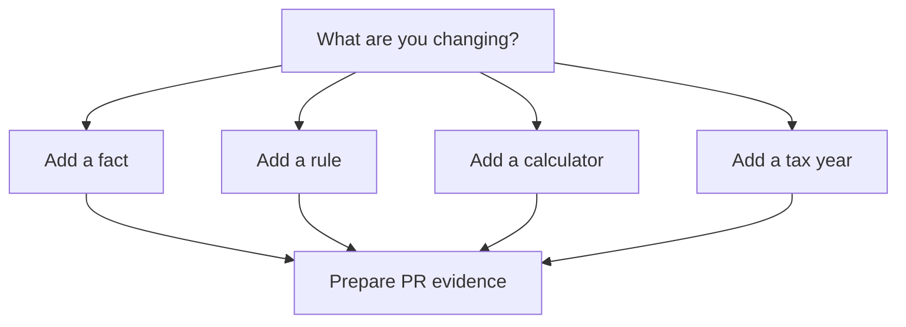

# Contributing

Use this section when you want to propose a tax behaviour change and prepare a
pull request with source evidence, tests and release-impact notes.

## Planned pages

- Overview
- What are you changing?
- Contribution workflow
- Domain model
- Add a fact
- Add a rule
- Add a calculator
- Add a tax year
- Fix an incorrect result
- Testing
- Standards
- Pull requests

## Contribution flow

## Related sections

- [Concepts](../concepts/index.mdx)
- [Guides](../guides/index.mdx)
- [Reference](../reference/index.mdx)
