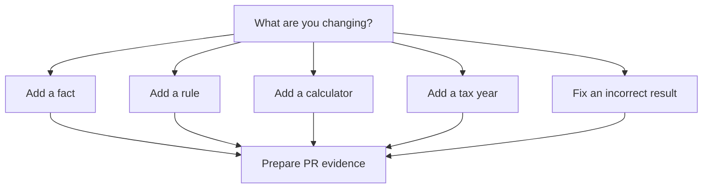

# Contributing

Use this section when you want to propose a tax behaviour change and prepare a
pull request with source evidence, tests and release-impact notes.

## Start with your intent

- [What are you changing?](./what-are-you-changing.mdx) routes common
  contribution intentions to the right guide.
- [Fix an incorrect result](./fix-an-incorrect-result.mdx) explains how to
  reproduce and correct a calculation issue.
- [PR evidence checklist](./pr-evidence-checklist.mdx) lists the evidence your
  pull request must include.

## Contribution flow

## Contribution guides

- [Add a fact](./add-a-fact.mdx)
- [Add a rule](./add-a-rule.mdx)
- [Add a calculator](./add-a-calculator.mdx)
- [Add a tax year](./add-a-tax-year.mdx)

## Standards

- [Testing standards](./testing-standards.mdx)
- [Source citation standards](./source-citation-standards.mdx)
- [Naming and schema standards](./naming-and-schema-standards.mdx)
- [Effect service standards](./effect-service-standards.mdx)
- [Backward compatibility](./backward-compatibility.mdx)
- [Changesets](./changesets.mdx)
- [Review expectations](./review-expectations.mdx)

## Related sections

- [Concepts](../concepts/index.mdx)
- [Guides](../guides/index.mdx)
- [Reference](../reference/index.mdx)
- [Package ownership](../../../../docs/architecture/package-ownership.md)
