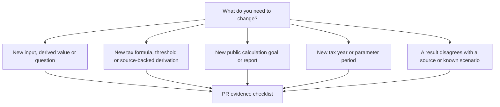

# What are you changing?

Use this page when you know the behaviour you want to change, but not the
owning package or review evidence yet.

| If you want to                                                                      | Start with                                               | Owning package                                                                                     |
| ----------------------------------------------------------------------------------- | -------------------------------------------------------- | -------------------------------------------------------------------------------------------------- |
| Add an input fact, derived fact or question prompt                                  | [Add a fact](./add-a-fact.mdx)                           | Usually `@whattax/core` for shared descriptors, or the owning rule package for rule-specific facts |
| Add or change a tax formula, threshold, parameter table or source-backed derivation | [Add a rule](./add-a-rule.mdx)                           | `@whattax/rules-au-pay`, `@whattax/rules-au-income-tax` or `@whattax/rules-au-stsl`                |
| Add a public calculation goal, request context or report shape                      | [Add a calculator](./add-a-calculator.mdx)               | Rule package for the calculator program, `@whattax/calculators` for reusable orchestration         |
| Add support for another tax year                                                    | [Add a tax year](./add-a-tax-year.mdx)                   | The rule package that owns the parameter table and calculator context                              |
| Fix a reported incorrect result                                                     | [Fix an incorrect result](./fix-an-incorrect-result.mdx) | The package that owns the failing fact, rule, parameter table or calculator                        |
| Change HTTP endpoint shape or SDK helper shape                                      | [Backward compatibility](./backward-compatibility.mdx)   | `@whattax/http-api` for transport contracts, `@whattax/sdk` for SDK facades                        |
| Prepare a reviewable pull request                                                   | [PR evidence checklist](./pr-evidence-checklist.mdx)     | The package you changed, plus public docs when behaviour changes                                   |

## Boundary rule

HTTP and SDK layers must not hide tax business logic. Put calculator lookup,
fact decoding, rule execution, graph assembly and expected calculator errors
in the owning engine, rule or calculator package. HTTP handlers can translate
route input and status envelopes. SDK helpers can adapt developer-facing calls
to canonical calculator requests.

For deeper boundaries, read
[Package ownership](../../../../docs/architecture/package-ownership.md) and
[API and SDK](../../../../docs/architecture/api-and-sdk.md).

## Next step

Open the guide that matches your intent, then keep
[PR evidence checklist](./pr-evidence-checklist.mdx) open while you work.
