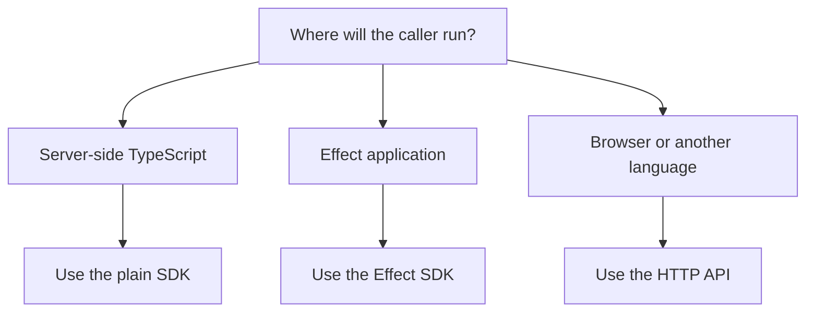

# Choose SDK or HTTP API

Choose the SDK when your application can import TypeScript packages. Choose the
HTTP API when you need a network boundary, a browser-safe caller or a
non-TypeScript integration.

## Choose by environment

| Environment                                      | Choose     | Why                                                                                                             |
| ------------------------------------------------ | ---------- | --------------------------------------------------------------------------------------------------------------- |
| Server-side TypeScript application               | Plain SDK  | You get typed calculator inputs and reports without HTTP transport.                                             |
| TypeScript application that wants typed failures | Safe SDK   | You get `WhatTax.safe.calculate` result values.                                                                 |
| Effect application                               | Effect SDK | You can compose `calculateRunRequest`, `calculateReportRequest` and `calculateReport` with services and layers. |
| Browser application                              | HTTP API   | You avoid importing server-side calculation packages into the browser.                                          |
| Non-TypeScript backend                           | HTTP API   | You can use JSON and generated OpenAPI reference.                                                               |
| Generated endpoint contract                      | HTTP API   | OpenAPI owns endpoint shape and status codes.                                                                   |

## Recommended paths

The HTTP API is a thin transport over the SDK and calculator service. It should
not contain calculator business logic that is missing from the SDK path.

## Next steps

- Use [Plain SDK](../sdk/plain-sdk.mdx) for most server-side TypeScript apps.
- Use [Effect SDK](../sdk/effect-sdk.mdx) for in-process Effect composition.
- Use the API section when you need HTTP endpoint details.
