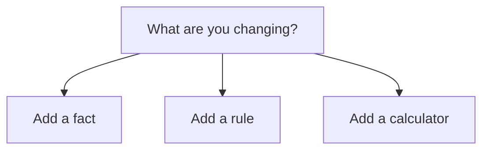

# Documentation architecture

Use this guide when adding docs structure, navigation, MDX content roots or
new documentation ownership.

## Source-of-truth layers

WhatTax uses different docs layers for different readers:

| Layer | Reader | Owns |
| --- | --- | --- |
| Public MDX docs | SDK/API consumers and contributors | Task-first guides, concepts, examples and reference |
| Package READMEs | Package consumers and maintainers | Package-local exports, commands and guardrails |
| Architecture docs | Maintainers and agents | Durable boundaries, package ownership and runtime flows |
| Standards docs | Contributors and agents | Writing, code, versioning and review rules |
| Product specs | Implementers | Current intent and planned implementation |
| Exec plans | Implementers | Live task progress and validation evidence |

Do not collapse these layers. Public docs may link to architecture docs, but
they should not become architecture manuals.

## Public docs navigation

The public MDX docs should use one primary navigation model:

```txt
Documentation
  Start
  SDK
  API
  Guides
  Concepts
  Contributing
  Reference
```

If the docs framework supports anchors or product groups, use:

```txt
Documentation
  Start
  SDK
  Guides
  Concepts
  Contributing

API reference
  OpenAPI
  Endpoints
  Errors

Resources
  Examples
  Changelog
  GitHub
```

## Page ownership

Use these homes unless a spec chooses a different implementation path:

| Content | Home |
| --- | --- |
| Public MDX pages | `apps/docs` or chosen docs content root |
| Developer docs style | `docs/standards/*` |
| Package-local docs | package `README.md` |
| Architecture | `docs/architecture/*` |
| Product intent | `docs/product-specs/*` |
| Active implementation evidence | `docs/exec-plans/active/*` |

## MDX rules

Public MDX pages should:

- include title and description frontmatter
- use stable, descriptive URLs
- use sentence-case titles and sidebar labels
- link to related pages with descriptive text
- avoid private downstream product names
- avoid documenting planned package surfaces as implemented
- include code examples where they help the reader act
- link to generated OpenAPI reference for endpoint details

## Diagrams

Use diagrams where they clarify structure or flow.

Prefer fenced call graphs for runtime and package ownership:

```ts
Production: HTTP calculate

HTTP caller
  -> @whattax/http-api route contract
    -> @whattax/sdk/effect calculateRunRequest
      -> PublicCalculatorService.calculate
```

Prefer Mermaid flowcharts for branching decisions:



Avoid decorative diagrams and sequence diagrams unless they are clearly the
best option.

## Generated reference

Reference pages should be generated or derived where possible:

- API endpoint reference from OpenAPI
- SDK export reference from package exports or typed examples
- schema reference from canonical schema modules
- changelog and release notes from Changesets where practical

Narrative pages should explain usage, choices and error handling. Generated
reference should own field-level endpoint detail.

## Content drift rules

When implementation changes:

- update public docs if developer behaviour changes
- update package READMEs if package exports, commands or guardrails change
- update architecture docs if ownership or runtime boundaries change
- update specs or task lists if implementation intent changes
- update exec plans only for active implementation evidence

Do not leave old names in public docs after renames unless the page is a
migration guide.
