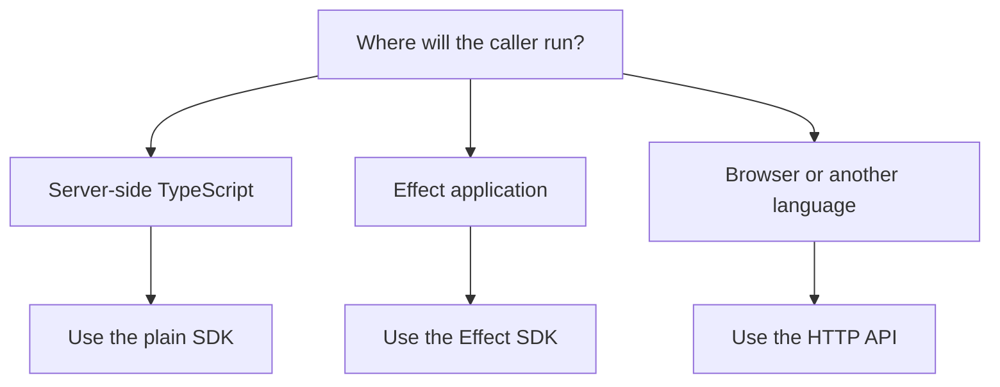

# Choose SDK or HTTP API

Choose the SDK when your application can import TypeScript packages. Choose the
HTTP API when the calculation should run on the server or the caller cannot
import TypeScript packages. The SDK's root, AU and schema entrypoints also
support browser callers; those calculations run on the caller's device.

## Choose by environment

| Environment                                      | Choose          | Why                                                                                                             |
| ------------------------------------------------ | --------------- | --------------------------------------------------------------------------------------------------------------- |
| Server-side TypeScript application               | Plain SDK       | You get typed calculator inputs and reports without HTTP transport.                                             |
| TypeScript application that wants typed failures | Safe SDK        | You get `TaxKit.safe.calculate` result values.                                                                  |
| Effect application                               | Effect SDK      | You can compose `calculateRunRequest`, `calculateReportRequest` and `calculateReport` with services and layers. |
| Browser application                              | HTTP API or SDK | HTTP sends the request to the server; the browser-safe SDK calculates on the device.                            |
| Non-TypeScript backend                           | HTTP API        | You can use JSON and generated OpenAPI reference.                                                               |
| Generated endpoint contract                      | HTTP API        | OpenAPI owns endpoint shape and status codes.                                                                   |

## Recommended paths

The HTTP API calls the calculator service directly. The SDK calls the same
service in-process. Keep tax logic in the shared calculator and rule packages.

## Next steps

- Use [Plain SDK](../sdk/plain-sdk.mdx) for most server-side TypeScript apps.
- Use [Effect SDK](../sdk/effect-sdk.mdx) for in-process Effect composition.
- Use the API section when you need HTTP endpoint details.
